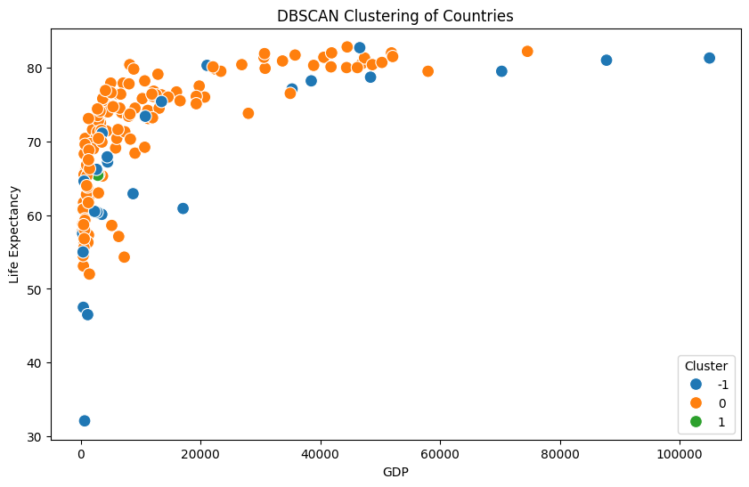
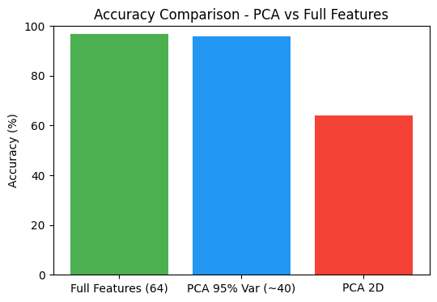

# Unsupervised-learning-mini-projects

### 1️⃣ Customer Segmentation using K-Means  
Segmented mall customers into distinct groups based on Age, Annual Income, and Spending Score to help businesses target marketing strategies effectively.

---
### 2️⃣ Hierarchical Clustering – Iris Dataset

Clustered Iris flower samples into groups using hierarchical clustering and dendrogram visualization. Identified 3 natural clusters corresponding to the species (Setosa, Versicolor, Virginica), with Setosa being clearly distinct while Versicolor and Virginica showed partial overlap.

---

### 3️⃣ Country Clustering using DBSCAN

Applied DBSCAN to cluster countries based on socio-economic indicators (like GDP, population, and life expectancy). Detected dense groups of similar countries while identifying outliers, helping to spot unusual or unique patterns across nations.

---

### 4️⃣ Dimensionality Reduction with PCA – Digits Dataset  
Applied **Principal Component Analysis (PCA)** on the handwritten digits dataset to reduce feature dimensions while retaining most of the information.  

- Without PCA (64 features): Accuracy ≈ 97%  
- With PCA (95% variance, ~40 features): Accuracy ≈ 96%  
- With PCA (2 components): Accuracy ≈ 64% (mainly for visualization)

  

