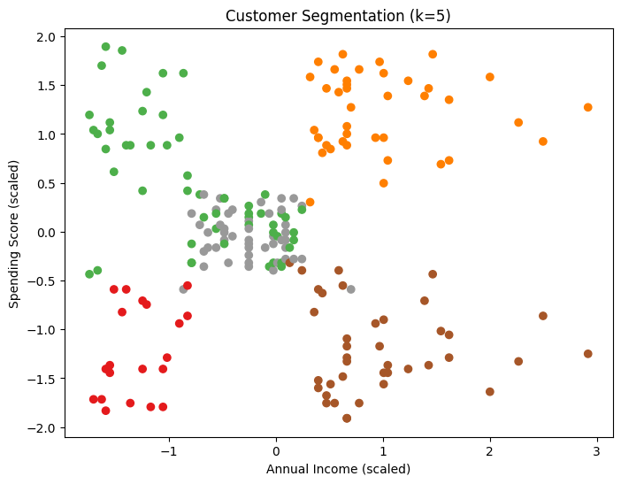

# Unsupervised-learning-mini-projects

### 1️⃣ Customer Segmentation using K-Means  
Segmented mall customers into distinct groups based on Age, Annual Income, and Spending Score to help businesses target marketing strategies effectively.

---
